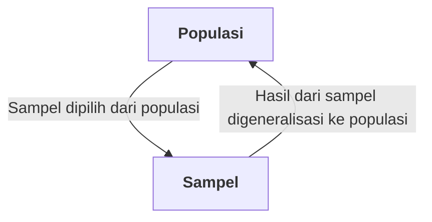

Statistika adalah ilmu yang membahas tentang pengembangan dan pembelajaran terkait metode untuk mengumpulkan, menganalisa, menginterpretasi, dan mempresentasikan data empirik. Dua ide fundamental dari statistika adalah ketidakpastian dan variasi. 

Probabilitas adalah bahasa matematika yang digunakan untuk membahas peristiwa yang tidak pasti dan memainkan peran kunci dalam statistika.

# Variabel, Populasi, dan Sampel

Variabel adalah karakteristik atau kondisi yang dapat berubah atau memiliki nilai yang berbeda-beda. Penelitian biasanya dimulai dengan pertanyaan mengenai hubungan antara dua variabel. 

Populasi adalah keseluruhan kelompok individu yang menjadi fokus penelitian. 

Sampel adalah sebagian individu yang dipilih untuk mewakili populasi dalam sebuah penelitian. Tujuan utamanya adalah menggunakan hasil dari sampel untuk menjawab pertanyaan tentang populasi.

Terdapat dua tipe variabel, yaitu: 
1. Variabel diskrit, merupakan variabel yang tidak dapat dibagi (bilangan bulat)
2. Variabel kontinu, merupakan variabel yang dapat dibagi secara tidak terbatas ke dalam unit yang lebih kecil. Untuk mendefinisikan variabel kontinu, peneliti harus menggunakan  ***real limit*** untuk menentukan batasan yang terletak tepat di tengah-tengah kategori yang berdekatan.

# Skala Pengukuran
Terdapat empat skala pengukuran, yaitu:
1. Skala nomina adalah skala yang tidak berurutan dan hanya diindentifikasi berdasarkan nama. Skala ini  menentukan dua individual sama atau berbeda
2. Skala ordinal adalah skala yang memiliki urutan. Skala ini menunjukkan arah perbedaan antara individu.
3. Skala interval adalah kategori yang berurutan dengan interval yang sama besar. Skala ini menunjukkan arah dan besaran perbedaan, namun titik nolnya bersifat arbitrer.
4. Skala rasio adalah kategori di mana nilai nol mutlak menunjukkan ketiadaan variabel tersebut. Skala ini memungkinkan perbandingan rasio dari pengukuran.

# Studi Statistika
Terdapat dua jenis studi statisika, yaitu studi korelasional, studi eksperimental, dan studi non-eksperimental.
## Studi Korelasional
Bertujuan untuk menentukan apakah ada hubungan antara dua variabel dan mendeskripsikan hubungan tersebut. Metode yang digunakan adalah mengamati dua variabel tanpa ada manipulasi

## Studi Eksperimental
Bertujuan untuk menunjukkan hubungan sebab akibat antara dua variabel. Metode yang digunakan adalah salah satu variabel (variabel independen) dimanipulasi untuk menciptakan kondisi perlakuan dan variabel lainnya diamati perbedaannya. Semua variabel dikendalikan untuk mencegah pengaruh luar.

## Studi Non-Eksperimental 
Disebut juga kuansi-eksperimental. Studi ini membandingkan kelompok skor seperti eksperimen, tetapi tidak menggunakan variabel yang dimanipulasi. Variabel yang membedakan kelompok biasanya adalah variabel yang sudah ada sebelumnya pada partisipan (seperti jenis kelamin) atau variabel waktu (sebelum/sesudah). Karena tidak ada manipulasi dan kontrol, studi ini tidak dapat menunjukkan hubungan sebab-akibat, sehingga lebih mirip dengan studi korelasional.

# Statistika Deskriptif dan Inferensial
Statistika deskriptif adalah metode untuk mengorganisasi dan merangkum data, seperti menggunakan tabel, grafik, dan lain-lain. Nilai deskriptif untuk populasi adalah parameter dan nilai deskriptif untuk sampel adalah statistik. Sedangkan, statistika inferensial adalah metode yang menggunakan data sampel untuk membuat kesimpulan umum (inferensi) tentang populasi.

# Sampling Error
Sampling error adalah diskrepansi atau selisih yang terjadi antara statistik sampel dengan parameter populasi yang sesuai.Mendefinisikan dan mengukur _sampling error_ adalah bagian besar dari statistika inferensial.